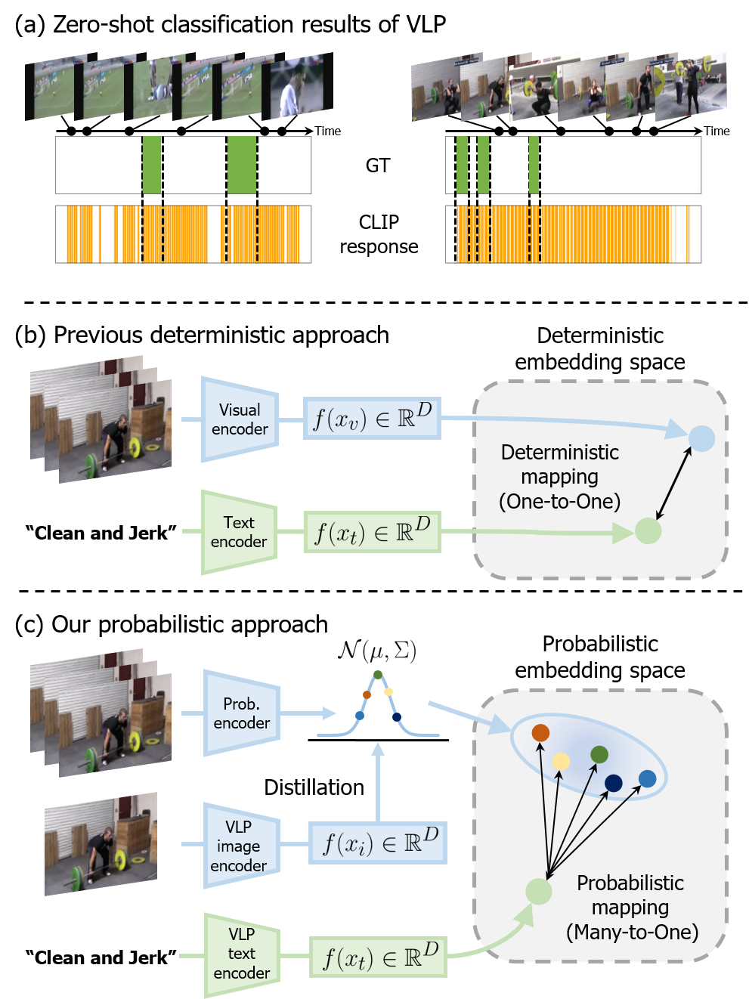

# PECR

### Official Pytorch Implementation of [Probabilistic Vision-Language Representation for Weakly Supervised Temporal Action Localization]() (MM 2024, Under Review)

---


> **Probabilistic Embedding with CLIP Representation for Weakly Supervised Temporal Action Localization**<br>
> Geuntaek Lim (Sejong Univ.), Hyunwoo Kim (Sejong Univ.), Gio Paik (Sejong Univ.), Joonsoo Kim (ETRI), and Yukyung Choi (Sejong Univ.)
>
>
> **Abstract:** *Weakly supervised temporal action localization (WTAL) aims to detect action instances in untrimmed videos with only video-level annotations. However, many existing works encounter the task discrepancy problem by optimizing WTAL models based on action classification labels. To tackle this issue, the introduction of textual information about action categories can provide additional training guidance through vision-language pretrained models, e.g., Contrastive Language-Image Pretraining (CLIP). Nevertheless, the pretrained CLIP representation may not be optimal for human action understanding due to deterministic image-text pretraining. In this paper, we propose a novel framework called Probabilistic Embedding with CLIP Representation (PECR), which aligns the pretrained action snippet and CLIP knowledge in a probabilistic embedding space. We introduce a probabilistic adapter to the base WTAL head to estimate parameters for the desired distribution. To optimize the incorporation of CLIP’s largescale knowledge, we utilize CLIP’s deterministic representation to partially estimate parameters, e.g., mean vector, for the desired distribution. Furthermore, we introduce distribution metric learning to enhance the similarity between distributions that exhibit similar content in their estimated probability distributions. We evaluate our method on two popular benchmarks: THUMOS14 and ActivityNet v1.2. Extensive experiments and ablation studies reveal that our method significantly outperforms prior state-of-the-art methods.*


# 🔨 Prerequisites

### Recommended Environment
* We strongly recommend following the environment, which is very important as to whether it's reproduced or not.
  * OS : Ubuntu 18.04
  * CUDA : 10.2
  * Python 3.7.16
  * Pytorch 1.7.1 Torchvision 0.8.2
  * GPU : NVIDA-Tesla V100(32G)

* Required packages are listed in **environment.yaml**. You can install by running:

```
conda env create -f environment.yaml
conda activate PECR
```

### Data Preparation
* For convenience, we provide the features we used. You can find them here.
   * THUMOS'14 : [Google Drive]()
   * ActivityNet v1.2 : [Google Drive]()
* Before running, Place the features inside a ```PECR/features``` folder.

## 👍 References
We referenced the repos below for the code.
* [CLIP](https://github.com/openai/CLIP)
* [CO2-Net](https://github.com/harlanhong/MM2021-CO2-Net)
* [CoLA](https://github.com/zhang-can/CoLA)
* [Efficient-Prompt](https://github.com/ju-chen/Efficient-Prompt)

## ✉ Contact
If you have any question or comment, please contact using the issue.
