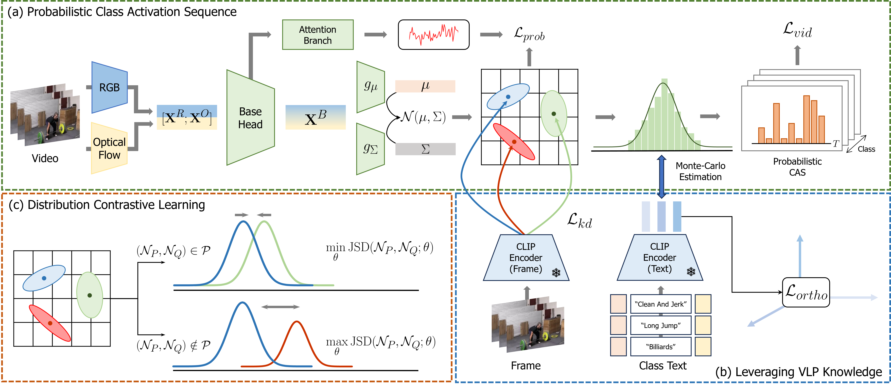

# PVLR

### Official Pytorch Implementation of [Probabilistic Vision-Language Representation for Weakly Supervised Temporal Action Localization]() 

---


> **Probabilistic Vision-Language Representation for Weakly Supervised Temporal Action Localization**<br>
> Geuntaek Lim (Sejong Univ.), Hyunwoo Kim (Sejong Univ.), Joonsoo Kim (ETRI), and Yukyung Choi (Sejong Univ.)
>
>
> **Abstract:** *Weakly supervised temporal action localization (WTAL) aims to detect action instances in untrimmed videos with only video-level annotations. As many existing works optimize WTAL models based on action classification labels, they encounter the task discrepancy problem (i.e., localization-by-classification). To tackle this issue, recent studies have attempted to utilize action category names as auxiliary semantic knowledge with vision-language pre-training (VLP). However, there are still areas where existing research falls short. Previous approaches primarily focused on leveraging textual information from language models but overlooked the alignment of dynamic human action and VLP knowledge in joint space. Furthermore, the deterministic representation employed in previous studies struggles to capture fine-grained human motion. To address these problems, we propose a novel framework that aligns human action knowledge and VLP knowledge in the probabilistic embedding space. Moreover, we propose intra- and inter-distribution contrastive learning to enhance the probabilistic embedding space based on statistical similarities. Extensive experiments and ablation studies reveal that our method significantly outperforms all previous state-of-the-art methods.*


## Prerequisites

### Recommended Environment
* We strongly recommend following the environment, which is very important as to whether it's reproduced or not.
  * OS : Ubuntu 18.04
  * CUDA : 10.2
  * Python 3.7.16
  * Pytorch 1.7.1 Torchvision 0.8.2
  * GPU : NVIDA-Tesla V100 (32G)

* Required packages are listed in **environment.yaml**. You can install by running:

```
conda env create -f environment.yaml
conda activate PVLR
```
### Data Preparation
* For convenience, we provide the features we used. You can find them here.
   * THUMOS'14 : [Google Drive](https://drive.google.com/file/d/19eFwdOFe-esSfv9D_BpHMJtZnpJib_Nw/view?usp=drive_link)
* The **feature** directory should be organized as follows:
~~~~
├── PVLR
   ├── features
      ├── Thumos14_CLIP
      ├── Thumos14-Annotations
      ├── Thumos14reduced
      └── Thumos14reduced-Annotations
~~~~
* Considering the difficulty in achieving perfect reproducibility due to different model initializations depending on the experimental device (e.g., different GPU setup), we provide the initialized model parameters we used.

* Please note that the parameters provided are the initial parameters before any training has been conducted.
   * ckpt : [Google Drive](https://drive.google.com/file/d/1SsaWPiaJfkTA-I4FSxKnmnLuIlOhpRux/view?usp=drive_link)

* The **checkpoint file**  should be organized as follows:
~~~~
├── PVLR
   ├── model
      ├── ...
      ├── ...
      └── PVLR_init.pth
~~~~

## Run

### Training
```
OMP_NUM_THREADS=1 CUDA_VISIBLE_DEVICES=0 python main.py --model-name PVLR
```

### Inference
```
OMP_NUM_THREADS=1 CUDA_VISIBLE_DEVICES=0 python eval/inference.py --pretrained-ckpt output/ckpt/PVLR/Best_model.pkl
```
## References
We referenced the repos below for the code.
* [CLIP](https://github.com/openai/CLIP)
* [CO2-Net](https://github.com/harlanhong/MM2021-CO2-Net)
* [CoLA](https://github.com/zhang-can/CoLA)
* [Efficient-Prompt](https://github.com/ju-chen/Efficient-Prompt)

## ✉ Contact
If you have any question or comment, please contact using the issue.
