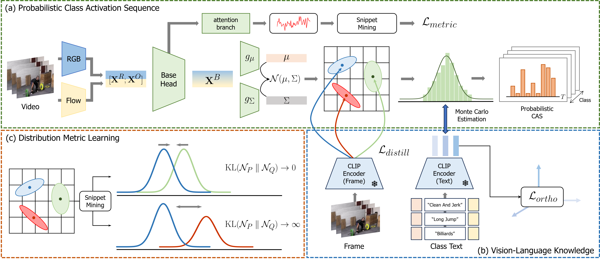

# 2024.Paper.PECR

### Official Pytorch Implementation of [Probabilistic Embedding with CLIP Representation for Weakly Supervised Temporal Action Localization]() (IEEE Access)

---


> **Probabilistic Embedding with CLIP Representation for Weakly Supervised Temporal Action Localization**<br>
> Geuntaek Lim (Sejong Univ.), Hyunwoo Kim (Sejong Univ.), Gio Paik (Sejong Univ.), Joonsoo Kim (ETRI), and Yukyung Choi (Sejong Univ.)
>
>
> **Abstract:** *Weakly supervised temporal action localization (WTAL) aims to detect action instances in untrimmed videos with only video-level annotations. Most existing works suffer from the task discrepancy problem, which optimizes WTAL models within action classification labels. To address this problem, action category textual information can offer additional training guidance via vision-language pretrain models (e.g., CLIP). However, the pretrained CLIP representation is not optimal for human action understanding due to deterministic image-text pretraining. In this paper, we propose a novel framework, Probabilistic Embedding with CLIP Representation (PECR), which aligns the pretrained action snippet and CLIP knowledge in a probabilistic embedding space. We introduce a probabilistic adapter to the base WTAL head to estimate parameters for the desired distribution. To optimize the incorporation of CLIP’s large-scale knowledge, we use CLIP’s deterministic representation to partially estimate parameters (e.g., mean vector) for the desired distribution. Furthermore, we propose distribution metric learning to enhance similarity between distributions exhibiting similar content in their estimated probability distributions. To this end, we measure the similarity between the distribution and the action category text embedding obtained through vision- language pretraining for action confidence score. We evaluate our method on two popular benchmarks: THUMOS14 and ActivityNet v1.2. Extensive experiments and ablation studies reveal that our method significantly outperforms state-of-the-art methods.*


# 🔨 Prerequisites

### Recommended Environment
* We strongly recommend following the environment, which is very important as to whether it's reproduced or not.
  * OS : Ubuntu 18.04
  * CUDA : 10.2
  * Python 3.7.16
  * Pytorch 1.7.1 Torchvision 0.8.2
  * GPU : NVIDA-Tesla V100(32G)

* Required packages are listed in **environment.yaml**. You can install by running:

```
conda env create -f environment.yaml
conda activate PECR
```

### Data Preparation
* For convenience, we provide the features we used. You can find them here.
   * [THUMOS'14]()
   * [ActivityNet1.2]()
* Before running, Place the features inside a ```PECR/features``` folder.

## 👍 References
We referenced the repos below for the code.
* [CLIP](https://github.com/openai/CLIP)
* [CO2-Net](https://github.com/harlanhong/MM2021-CO2-Net)
* [CoLA](https://github.com/zhang-can/CoLA)

## ✉ Contact
If you have any question or comment, please contact using the issue.
